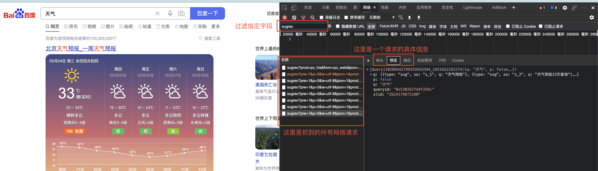
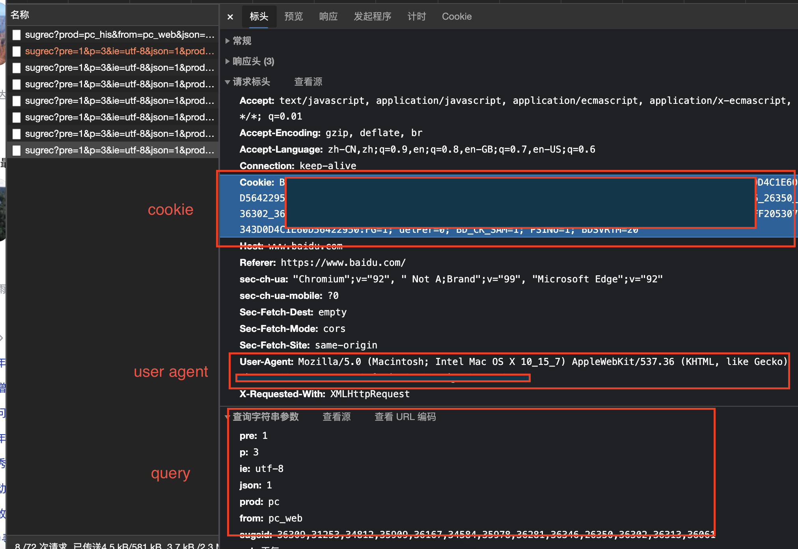
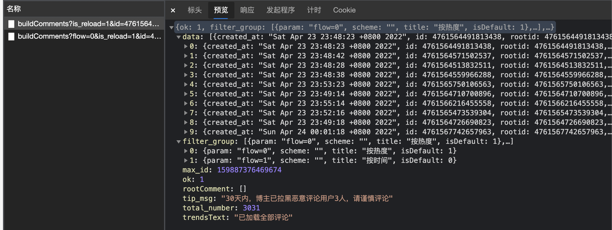
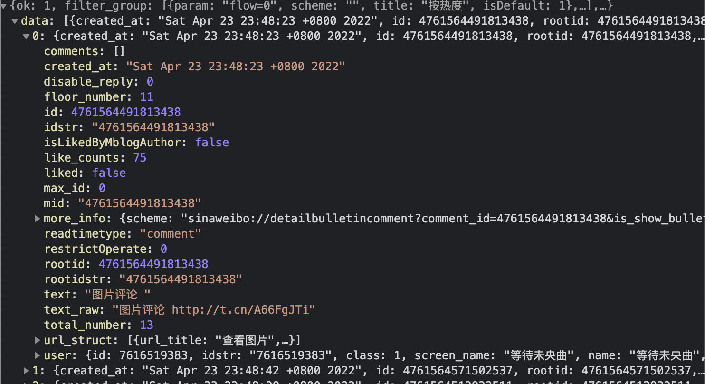
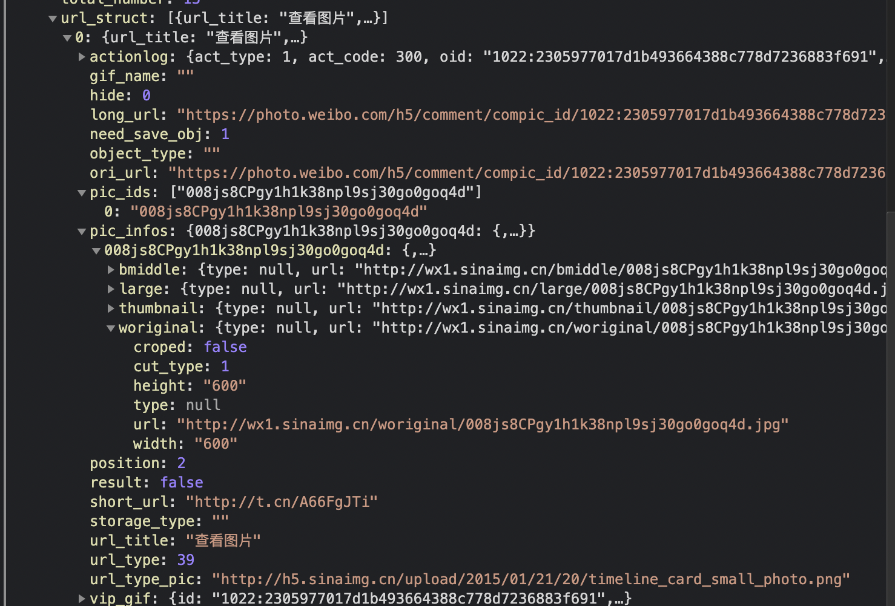
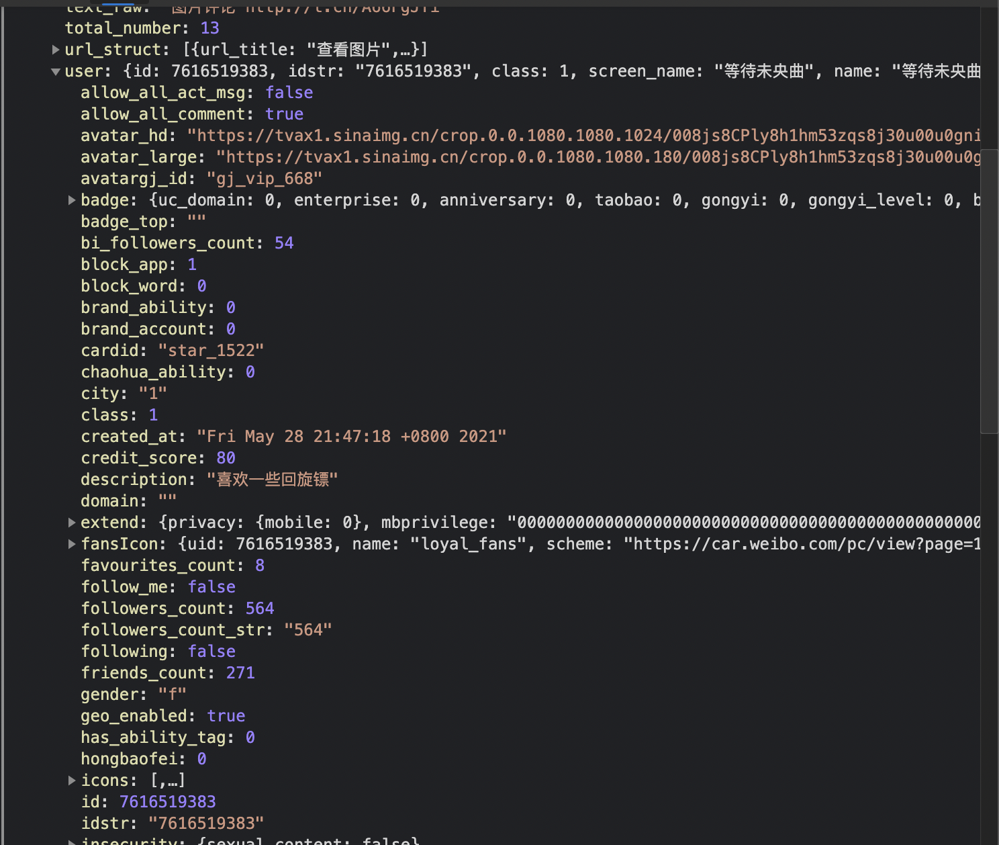
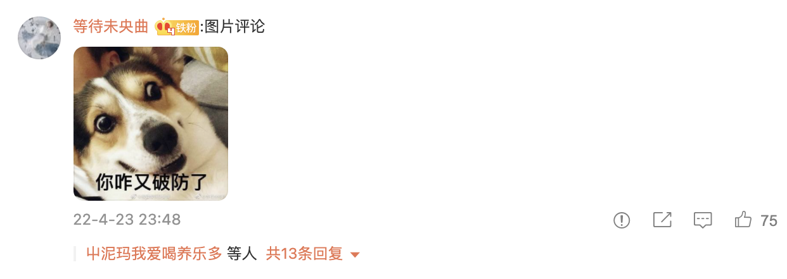
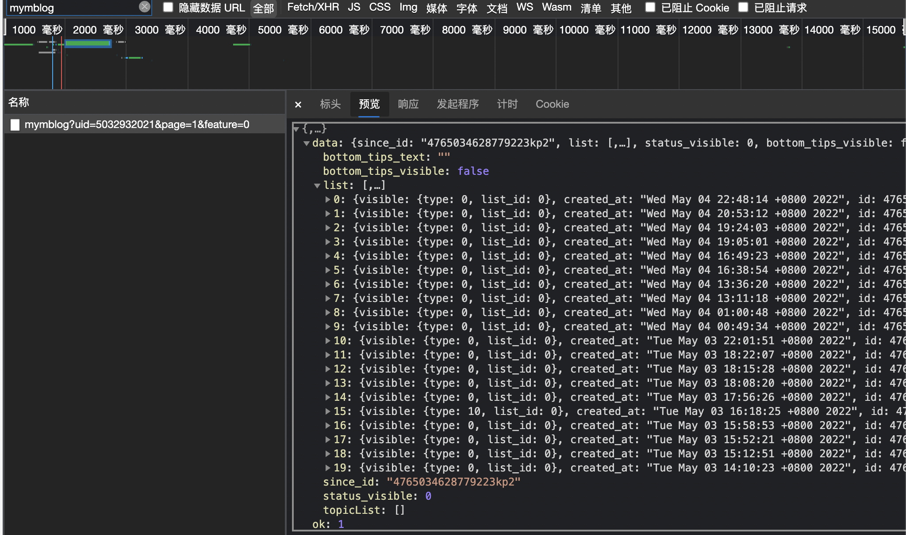
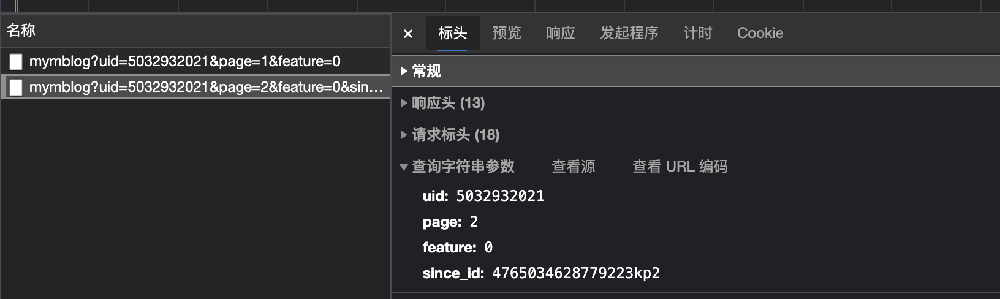
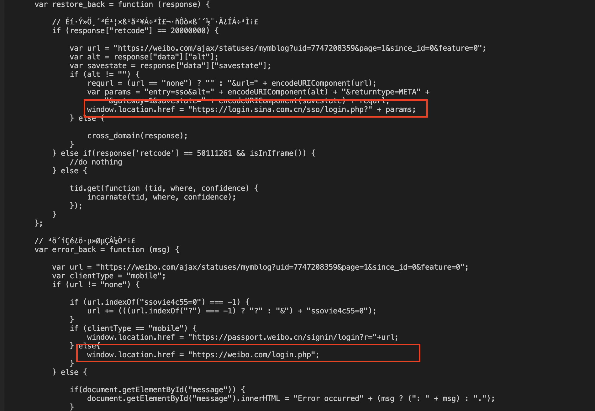

# 脚本爬取微博评论区图片

## 一、背景
	刷微博时看到了很有意思的表情包，所以想保存下来，但是手动挨个保存太麻烦了，就希望通过脚本快速保存评论区中的图片，以下完整讲述其实现。
	
	先附上完整代码链接：https://github.com/wpf9264/weibo_spider/blob/main/weibo_spider.py

## 二、基础知识
### 2.1 Python 测试函数
- 测试函数用于下载图片
- 使用`urllib`来进行网络请求z
- 通过`basename`来获取文件名

```
import os
from posixpath import basename
import urllib.request

def testNetworkV1():
    url = "https://wx4.sinaimg.cn/mw2000/008l2znhgy1h1t7gxf392j32c0340hdt.jpg"    
    request = urllib.request.Request(url)
    response = urllib.request.urlopen(request)
    img_name = basename(url)
    if (response.getcode() == 200):
        with open(img_name, "wb") as f:
            f.write(response.read())
        urllib.request.urlretrieve(url, file_name)

def testNetworkV2():
    url = "https://wx4.sinaimg.cn/mw2000/008l2znhgy1h1t7gxf392j32c0340hdt.jpg"    
    img_name = basename(url)
    urllib.request.urlretrieve(url, img_name)

# 解析url参数  
def testParseUrl():
    url = "https://weibo.com/ajax/statuses/buildComments?is_reload=1&id=4764434713804942&is_show_bulletin=2&is_mix=0&count=20&type=feed&uid=7743679062"
    result = urllib.parse.urlsplit(url)
    query = dict(urllib.parse.parse_qsl(result.query))
    print(query)
    
if __name__ == "__main__":
	testNetworkV1()
    testNetworkV2()
    testParseUrl()
```

### 2.2 浏览器抓包
- 以百度搜索天气为例，通过F12打开浏览器的开发者工具：
- 其中**预览**中以json格式显示当前网络请求的结果。
- 看下**标头**中我们会用到的信息：cookie，user-agent，query。其具体含义这里不再赘述。




## 三、微博评论区抓包分析
### 3.1 接口总览
- 微博评论区的接口：https://weibo.com/ajax/statuses/buildComments
- 该接口触发场景有四种：
	- 微博feed流中会展示有限几条评论 
	https://weibo.com/ajax/statuses/buildComments?is_reload=1&id=4761564396389176&is_show_bulletin=2&is_mix=0&count=20&type=feed&uid=5032932021
	- 点击评论区进去详情页的第一个请求
	https://weibo.com/ajax/statuses/buildComments?flow=0&is_reload=1&id=4761564396389176&is_show_bulletin=2&is_mix=0&count=10&uid=5032932021
	- 点击查看全部评论，在详情页随着下拉，会不断请求完整的数据 
	https://weibo.com/ajax/statuses/buildComments?flow=0&is_reload=1&id=4761564396389176&is_show_bulletin=2&is_mix=0&max_id=138859343277175&count=20&uid=5032932021
	- 点击一个评论的回复区，也会触发新的请求 
	https://weibo.com/ajax/statuses/buildComments?flow=1&is_reload=1&id=4761564491813438&is_show_bulletin=2&is_mix=1&fetch_level=1&max_id=0&count=20&uid=5032932021
- 接口数据分析
抓取连续两次的请求，分析其中的信息
	- data 字段中包含了当前所请求到的评论列表，这里共有10条评论。
	- filter_group 字段中清晰说明了评论的排序方式。
	- max_id 在下一次请求时携带在query中，可以理解为请求进度。



- 请求参数介绍
| 参数名 | 含义 |
|--------|--------|
|   is_reload     |暂不确定        |
|id|blog的标识|
|is_show_bulletin|暂不确定|
|flow|排序方式：0-热度，1-时间|
|is_mix|同flow，优先级较低|
|count|本次请求需要获取的评论个数|
|type|请求的场景，feed标识在微博feed流，详情页不需要|
|uid|当前blog的作者uid|
|max_id|在请求页中，上一次请求评论区返回的max_id，标识进度，若全部请求完成则返回0。仅用于详情页，实战时发现，若携带该参数，同一个max_id不可重复请求，否则只有第一次会生效，返回有效数据。修改count后才会继续返回对出的数据，猜测时后端有去重，避免多次返回。|
|fetch_level|暂不确定，获取评论的回复列表，必须携带|

### 3.2 评论数据详情分析
- 评论主体数据分析
	- id 就代表当前评论的标识
	- like_counts 标识点赞个数
	- text 表示评论的文本内容
	- url_struct 表示评论区的图片集合
	- user 表示评论者账号信息
	- comments 对当前评论对应的子回复
	

- 评论图片 url_struct 分析：
	- pic_ids 表示各图片的id集合
	- pic_infos  以id区分图片详情
	- worigin 代表原始图
	

- 评论作者账号信息：
	- id 账号uid
	- followers_count 粉丝个数
	- gender 性别 
	


## 四、实战-爬取评论区
基于以上数据分析，我们根据一条blog的bid及其作者uid即可爬取评论区中的图片。
这两个信息通过抓包即可获取。

```
# 创建一个class用于获取一条blog下所有评论图，blog标识定为bid
class CommentSpider(object):
    def __init__(self) -> None:
        self.image_url_array = []

    # 获取当前blog本身携带的图片
    def getBlogImage(self, raw_data):
        if "pic_infos" in raw_data and "pic_ids" in raw_data:
            pic_ids = raw_data["pic_ids"]
            pic_infos = raw_data["pic_infos"]
            for single_id in pic_ids:
                real_url = pic_infos[single_id]["original"]["url"]
                if real_url not in self.image_url_array:
                    self.image_url_array.append(real_url)
                    # print("##### ", real_url)
    
    # 根据bid，获取当前blog评论区中所有的图片
    def getAllComment(self, uid, bid):
        # max_id 为 0 时爬取第一页，后续请求的 max_id 可以从前一条请求中解析得到
        max_id = 0
        while(True):
            # print("#### max_id:", max_id)
            raw_data = self.getCommentWorkflow(uid, bid, max_id, False)
            if raw_data != None:
                max_id = self.getCommentImage(raw_data)
                if max_id == 0:
                    break
        print("### 图片个数:", len(self.image_url_array))
        for item in self.image_url_array:
            self.download(item)

    # 根据bid，max_id，发出一次请求
    def getCommentWorkflow(self, uid, bid, max_id, is_sub):
        url = "https://weibo.com/ajax/statuses/buildComments"
        headers = {
            "user-agent": "Mozilla/5.0 (Macintosh; Intel Mac OS X 10_15_7) AppleWebKit/537.36 (KHTML, like Gecko) Chrome/92.0.4515.107 Safari/537.36 Edg/92.0.902.55",
        }
        params = {
            "flow" : 0,
            "is_reload" : 1,
            "id" : bid,
            "is_show_bulletin" : 2,
            "is_mix" : 0,
            "max_id" : max_id,
            "count" : 20,
            "uid" : uid
        }
        r = requests.get(url, headers= headers, params=params)
        if r.status_code == 200:
            return r.json()
        else:
            return None
    
    # 解析评论区，获取本次请求中获取的评论图片
    def getCommentImage(self, raw_data):
        data = raw_data["data"]
        max_id = raw_data["max_id"]
        for item in data:
            user = item["user"]
            userName = user["name"]
            if "url_struct" in item:
                url_struct = item["url_struct"]
                for single in url_struct:
                    if "pic_infos" in single and "pic_ids" in single:
                        pic_ids = single["pic_ids"]
                        pic_infos = single["pic_infos"]
                        for single_id in pic_ids:
                            real_url = pic_infos[single_id]["woriginal"]["url"]
                            if real_url not in self.image_url_array:
                                self.image_url_array.append(real_url)
                                # print("##### ", real_url)

        return max_id


    def download(self, url):
        file_name = "./image/"+basename(url)
        # 已经下载的文件跳过
        if os.path.exists(file_name):
            pass
        else:
            urllib.request.urlretrieve(url, file_name)
            print("#### "+ file_name + "下载完成。")  

```
以上的代码只能爬取评论区中主评论的图片，但是实际上主评论也是可以被回复的，如图所示。
点击后发现会再次出发一个新的请求，其中的id就是该评论的id，uid就是其作者uid。
简单说就是将这个评论当做一个单独的blog。为了获取其回复列表中的图片，那就需要递归去查询。



抓包后发现query中多了一个参数 `fetch_level`，对原有的方法进行改造，贴上改造代码，不再赘述。
```
    # is_sub 区分是否为评论的回复
    def getCommentWorkflow(self, uid, bid, max_id, is_sub):
        url = "https://weibo.com/ajax/statuses/buildComments"
        headers = {
            "user-agent": "Mozilla/5.0 (Macintosh; Intel Mac OS X 10_15_7) AppleWebKit/537.36 (KHTML, like Gecko) Chrome/92.0.4515.107 Safari/537.36 Edg/92.0.902.55",
        }
        params = {
            "flow" : 0,
            "is_reload" : 1,
            "id" : bid,
            "is_show_bulletin" : 2,
            "is_mix" : 0,
            "max_id" : max_id,
            "count" : 20,
            "uid" : uid
        }
        if is_sub == True:
            params["flow"] = 1
            params["is_mix"] = 1
            params["fetch_level"] = 1
        r = requests.get(url, headers= headers, params=params)
        if r.status_code == 200:
            return r.json()
        else:
            return None
    
    # 解析评论区，获取本次请求中获取的评论图片
    def getCommentImage(self, raw_data):
        data = raw_data["data"]
        max_id = raw_data["max_id"]
        for item in data:
            # 评论者 id，name，city
            user = item["user"]
            sub_uid = user["id"]
            if "url_struct" in item:
                url_struct = item["url_struct"]
                for single in url_struct:
                    if "pic_infos" in single and "pic_ids" in single:
                        pic_ids = single["pic_ids"]
                        pic_infos = single["pic_infos"]
                        for single_id in pic_ids:
                            real_url = pic_infos[single_id]["woriginal"]["url"]
                            if real_url not in self.image_url_array:
                                self.image_url_array.append(real_url)
                                # print("##### ", real_url)

            if "comments" in item:
                sub_bid = item["id"]
                sub_max_id = 0
                # sub_comments = item["comments"]  不用取出来，重新请求
                # print("找到子评论")
                while(True):
                    html = self.getCommentWorkflow(sub_bid, sub_uid, sub_max_id, True)
                    if html != None:
                        index2 = 0
                        sub_max_id = self.getCommentImage(html)
                        # max_id 为 0 时，表示爬取结束
                        if sub_max_id == 0:
                            break
        return max_id
```
基于以上的逻辑，已经可以完整的获取到一个blog的所有评论图。但如果有很多blog时，这样的操作就比较麻烦了，想到是不是可以直接拉取一个uid的blog列表？


## 五、个人主页抓包分析
- 个人主页的接口：`https://weibo.com/ajax/statuses/mymblog`
- 该接口的触发场景有两种：
	- 首次点击 
	https://weibo.com/ajax/statuses/mymblog?uid=5032932021&page=1&feature=0
	- 下拉后持续更新：
	https://weibo.com/ajax/statuses/mymblog?uid=5032932021&page=2&feature=0&since_id=4764730390480742kp2

- 抓取相邻两次请求数据分析：
	- list 中为blog列表
	- since_id 表示请求的进度，用于下次loadmore使用
	
	

- 参数说明
|参数|含义|备注|
|-|-|-|
|uid|账号id||
|page|按页进行请求||
|feature|不确定|必须传递|
|since_id|上一次请求返回的进度||

## 六、实战-爬取微博列表
只需要一个账号的uid即可爬取其所有的微博
```
# 获取uid所有的blog
class BlogSpider(object):
    def __init__(self, uid):
        self.comment_spider = CommentSpider()
        with open("./history.txt", "r") as file:
            self.download_history = file.read().splitlines()
        self.history_file = open("./history.txt", "a")
        self.getAllBlog(uid)

    # 获取uid全部微博
    def getAllBlog(self, uid):
        page = 1
        since_id = 0
        print("开始获取 uid={} 的评论图".format(uid))
        while(True):
            print("# page={}, sinceId = {}".format(page, since_id))
            raw_data = self.getBlogWorkflow(uid, page, since_id)
            since_id = self.getSinceId(uid, raw_data)
            page += 1
            if page > 2: # 最多看2页，40条微博
                break
            if since_id == "":
                break 

    # loadmore的实现逻辑
    def getBlogWorkflow(self, uid, page, since_id):
        url = "https://weibo.com/ajax/statuses/mymblog"
        headers = {
            "user-agent": "Mozilla/5.0 (Macintosh; Intel Mac OS X 10_15_7) AppleWebKit/537.36 (KHTML, like Gecko) Chrome/92.0.4515.107 Safari/537.36 Edg/92.0.902.55",
        }
        params = {
            "uid" : uid,
            "page" : page,
            "since_id":since_id,
            "feature":0
        }
        r = requests.get(url, headers = headers, params = params)
        if r.status_code == 200:
            return r.json()
        else:
            return None

    # 获取一次loadmore的since_id，并记录
    def getSinceId(self, uid, raw_data):
        blogs = raw_data["data"]["list"]
        since_id = raw_data["data"]["since_id"]
        for blog in blogs:
            bid = blog["id"]
            pidstr = blog["idstr"]
            text = blog["text"]
            if pidstr in self.download_history:
                print("## 已经下载过 bid={} 的评论图".format(bid))
                continue
            print("## 开始获取 bid={} 的评论图".format(bid))
            self.download_history.append(bid)
            self.history_file.write("{}\n".format(bid))
            self.comment_spider.getBlogImage(blog)
            self.comment_spider.getAllComment(uid, bid)
        return since_id
```
在实际运行时遇到一个问题：原始的接口在浏览器地址栏中输入后，是可以正常返回数据的。但是以上代码却报了一个报错。根据报错提示，有login相关逻辑，猜测是需要cookie。从request标头中复制出cookie加入到到脚本的header中再次尝试，可以正常获取到数据。注意：**cookie登录或退登是会发生变化的**。



## 七、一些思考
- 如何使用多线程优化？